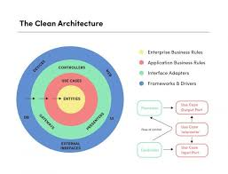
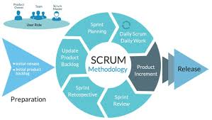

# App matricula en pytho,
esta aplicacion nos ayudara a tebner un mayor control de las matriculas de nuestros alumnos.
## Que podras hacer con mi aplicacion
- registrar alumnos.🧑🏿‍🤝‍🧑🏾
- generar ficha de matricula.🧧
- mostrar las listas de todos las matriculas. 📇
- filtrar matriculaspor programa de estudios.📋
## tecnologia
- pythom
- sqlite
- pydantc
- fastapt
## arquitectura
- arquitectura mvc
- arquitectura lipia

 
## metodologia de trabajo 
- scrum
- sp (extreming programing)
 
  
1. crear la carpeta del proyecto
```bash
mkdir app_matricula_python
```
2. acceder a la carpeta del proyecto
```bash
cd app_matricula_python
```
3. iniciar repositorio del proyecto
```bash
git init
```
4. crear entorno vitual de la carpeta
 ```bash
 python -m venv matricula
```
5. inicializar entorno virtual de la carpeta
```bash
source matricula/Scripts/activate
```
6. para desactivar la carpeta
```bash
deactiva
```
 